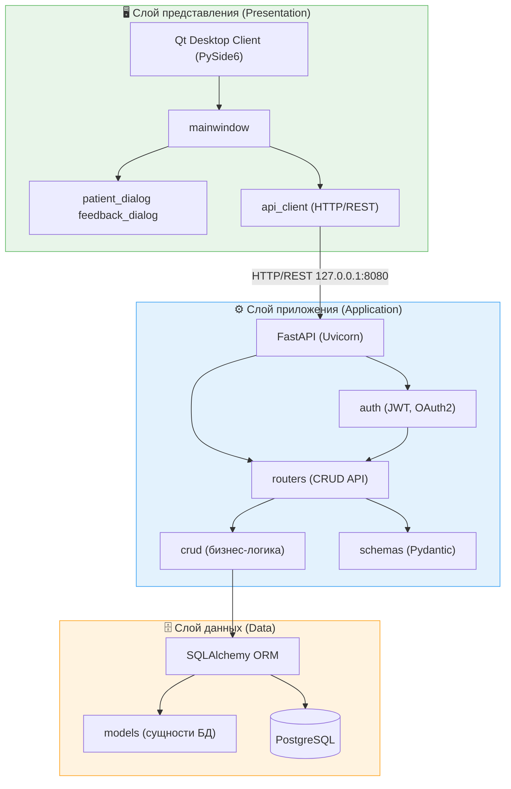
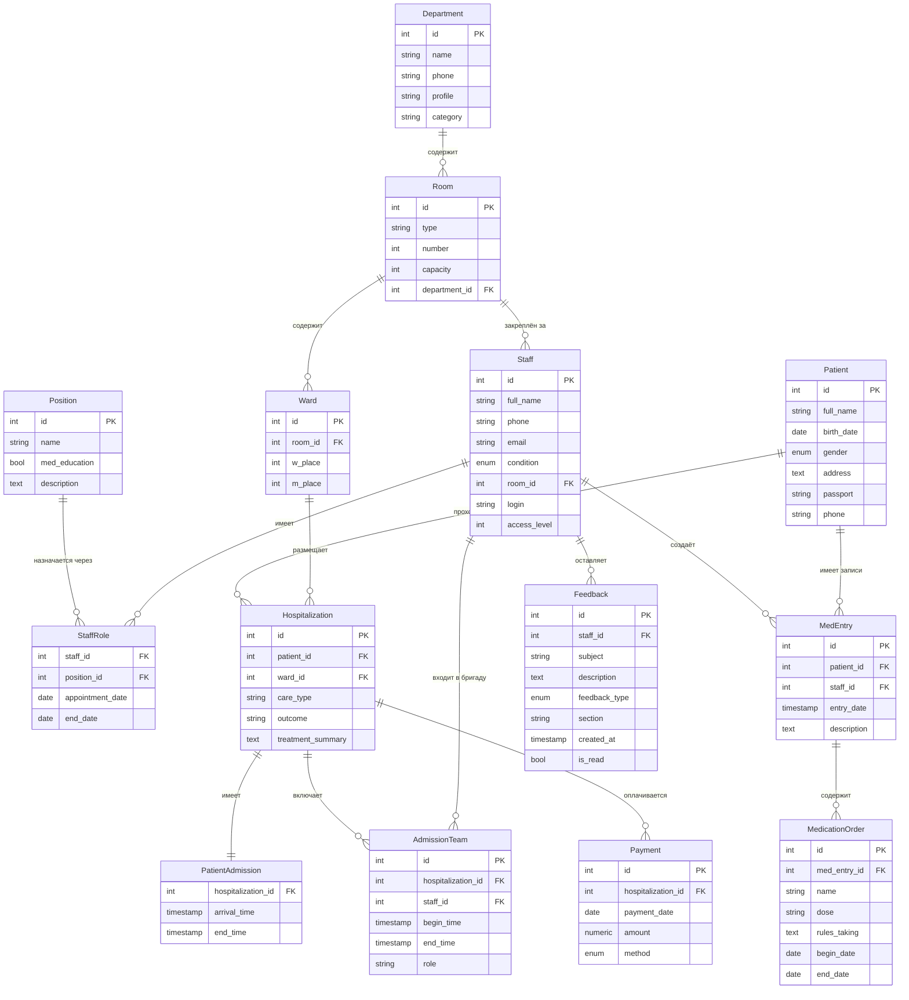

# Лабораторная №3

**Выаолнил:** Нагат М.С.

**Проект:** Hospital Inpatient Management System (HIMS)

## Часть 1. Проектирование архитектуры ("To Be")

Для разрабатываемой медицинской информационной системы (HIMS) на высоком уровне абстракций спроектированы следующие архитектурные решения:

### 1. Определение типа приложения

HIMS представляет собой **клиент-серверное десктопное приложение** с многоуровневой архитектурой (N-tier). 
Система реализуется как модульный монолит:

- **Слой представления (Presentation):** Толстый десктоп-клиент (Fat Client) на базе фреймворка Qt (PySide6).
- **Слой приложения (Application):** Асинхронный REST API-сервер.
- **Слой данных (Data):** Реляционная база данных.

### 2. Стратегия развёртывания

Целевая модель развёртывания ("To Be") — использование **контейнеризации (Docker)**.

- Backend (API) и База Данных упаковываются в изолированные Docker-контейнеры и запускаются через Docker Compose.
- В качестве Reverse Proxy используется Nginx, который принимает HTTP-запросы и маршрутизирует их к ASGI-серверу Uvicorn.
- Развёртывание производится на VPS медицинского учреждения (или в изолированной интрасети). 
- Предусмотрен пайплайн CI/CD (GitHub Actions) для автоматического тестирования и деплоя.

### 3. Обоснование выбора технологии

- **FastAPI:** Обеспечивает высокую производительность (ASGI), встроенную валидацию типов (Pydantic) и автоматическую генерацию OpenAPI-документации, что критично для клиент-серверного взаимодействия.
- **SQLAlchemy 2.0 + PostgreSQL:** Зрелая ORM в связке с мощной реляционной СУБД (PostgreSQL) гарантируют соблюдение принципов ACID, что абсолютно необходимо для защиты конфиденциальных медицинских и финансовых данных.
- **PySide6 (Qt):** Обеспечивает кроссплатформенность, нативную производительность и безопасность (исключает браузерные уязвимости), что является стандартом для медицинских desktop-приложений закрытого контура.

### 4. Показатели качества

- **Надёжность:** Uptime API ≥ 99%, транзакционность операций, наличие встроенного механизма резервного копирования (`/api/admin/dump`).
- **Производительность:** Время отклика (p95) < 500 мс для типовых запросов.
- **Безопасность:** Использование JWT для stateless-аутентификации, bcrypt-хэширование паролей, 4-уровневая ролевая модель доступа (от 0 до 3 уровня).

### 5. Пути реализации сквозной функциональности (Cross-cutting concerns)

- **Аутентификация/Авторизация:** Централизована на бэкенде (токены JWT передаются в заголовках `Authorization`). На API-маршрутах используется механизм инъекции зависимостей (FastAPI `Depends`) для защиты эндпоинтов.
- **Конфигурация:** Вынесена в переменные окружения (файл `.env` и модуль `python-dotenv`).
- **Обработка ошибок и логирование:** Единый механизм перехвата `HTTPException` на сервере и централизованный вывод ошибок пользователю через `QMessageBox` на стороне GUI. Обратная связь от пользователей собирается в отдельную таблицу `Feedback`.

### 6. Структурная схема приложения (Архитектура "To Be")

*Схема функциональных блоков и слоёв.*

---

## Часть 2. Анализ архитектуры ("As Is")

На основе реального исходного кода `models.py`, продемонстрированного на первом Sprint Review, была проведена обратная инженерия (Reverse Engineering) слоя данных (Data Layer). 

В текущем состоянии ("As Is") база данных является ядром монолита и включает справочные таблицы (LookUp Tables) и операционные (Operational Tables). Ниже сгенерирована диаграмма классов базы данных (Entity-Relationship/ORM models), демонстрирующая текущую степень нормализации и связи между сущностями.

Диаграмма классов получена при помощи pyreverse (pylint) и адаптирована в формат Mermaid для удобства представления в отчёте.

*Диаграмма классов моделей базы данных "As Is"*

---

## Часть 3. Сравнение и рефакторинг

### 1. Сравнение архитектур «As Is» и «To Be»

- **Среда развёртывания:** На этапе «As Is» приложение запускается локально (через скрипт `start.sh`, локальный Uvicorn и прямой доступ к БД). В целевой архитектуре «To Be» система полностью изолирована в контейнерах (Docker / Nginx), что обеспечивает отказоустойчивость.
- **Организация кода:** В текущем состоянии («As Is») интерфейс сильно связан с логикой запросов (прямые вызовы `requests` из `main_gui.py`). В состоянии «To Be» требуется строгое соблюдение многоуровневости.

### 2. Отличия и их причины

Текущая архитектура «As Is» — это результат первого спринта (MVP). Главной целью было обеспечение работоспособности основных бизнес-процессов (CRUD пациентов, госпитализаций, ролевая модель). Инфраструктурный слой (Nginx, Docker Compose) и глубокое разделение слоёв на клиенте были отложены во избежание преждевременной оптимизации (принцип YAGNI) и для скорейшей демонстрации продукта заказчику. 

### 3. Вывод и пути улучшения архитектуры

Для перехода к архитектуре «To Be» и предотвращения накопления технического долга, предлагаются следующие пути рефакторинга:

1. **Архитектурные паттерны на клиенте (MVC / MVVM):** Разделить монолитный файл GUI на визуальные компоненты (View), контроллеры состояний (Controller) и модули работы с сетью. Это обеспечит соблюдение принципа единственной ответственности (Single Responsibility Principle из SOLID).
2. **Паттерн Репозиторий (Repository) на бэкенде:** Изолировать прямые вызовы SQLAlchemy (слой Data) от FastAPI-маршрутизаторов (слой Application). Внедрение сервисного слоя (Service Layer) позволит покрыть бизнес-логику unit-тестами без необходимости поднимать реальную базу данных.
3. **Инфраструктура (DevOps):** Внедрение файла `docker-compose.yml` в корень проекта, что навсегда решит проблему "у меня на локальном компьютере всё работало" и подготовит систему к деплою в реальную сеть клиники (Production).

